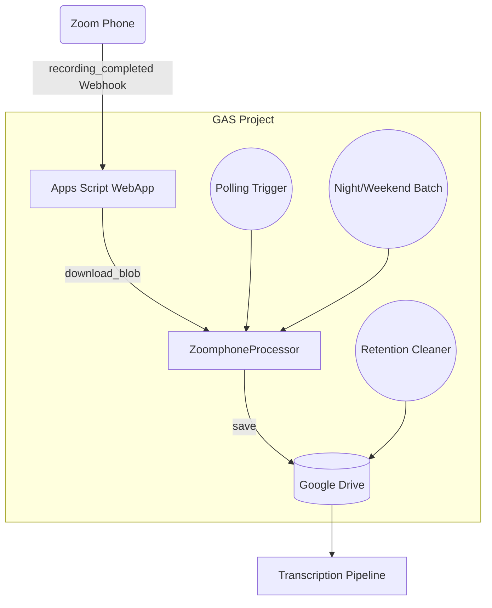

# Zoom Phone 録音ファイル連携 ― 詳細実装ガイド

本書では、Zoom Phone によって生成された通話録音ファイルを Google Drive に自動保存し、既存の文字起こしパイプラインへ連携するまでの手順です。

---

## 目次

1. [目的と概要](#sec1)
2. [前提条件および準備チェックリスト](#sec2)
3. [システム構成図](#sec3)
4. [Zoom Marketplace アプリの作成](#sec4)
5. [Google Apps Script (GAS) プロジェクト準備](#sec5)
6. [スクリプトプロパティ／Secret Manager 設定](#sec6)
7. [ソースコードの構成と役割](#sec7)
8. [Webhook 受信エンドポイントの実装](#sec8)
9. [録音ファイル取得および Drive 保存ロジック](#sec9)
10. [トリガー設計と実行時間制限対策](#sec10)
11. [リテンションバッチ（古い録音の削除）](#sec11)
12. [デプロイ手順](#sec12)
13. [動作確認およびテストシナリオ](#sec13)
14. [運用・監視の留意点](#sec14)
15. [トラブルシューティング](#sec15)
16. [更新履歴](#sec16)

---

<a id="sec1"></a>
## 1. 目的と概要

Zoom Phone で生成される通話録音ファイルを、以下の 3 つのステップで自動処理し、文字起こしパイプラインへ接続します。

1. Webhook によるリアルタイム取得
2. ポーリング／バッチによる取りこぼし補完
3. Google Drive への保存と後続処理への連携

下図はフローの全体像です。

```
[Zoom Phone]
    │  (録音完了)
    ├─▶ Webhook（リアルタイム通知）
    │          │
    │          ▼
    │     GAS doPost()
    │          │（保存）
    │          ▼
    │   Google Drive <────────┐
    │                         │（定期ポーリング）
    └──── Polling / Batch ────┘
```

リアルタイム性と冗長性を両立した構成とすることで、運用リスクを最小化します。

---

<a id="sec2"></a>
## 2. 前提条件および準備チェックリスト

| 区分 | 必須 / 任意 | 内容 | 補足 |
|------|-------------|------|------|
| Zoom | 必須 | Business 以上のアカウント | 録音機能が有効化されていること |
| Google | 必須 | Google Workspace（推奨） | 無料 Gmail でも動作可能だが実行時間が短い |
| 開発環境 | 必須 | `Node.js` / `npm` / `@google/clasp` | Node 18 以上を推奨 |
| Secret Manager | 任意（推奨） | Google Cloud Secret Manager | 認証情報の安全な保管 |

チェックリスト:

- Zoom 管理者権限を保有していること
- Google Workspace アカウントで Apps Script が利用可能であること
- `git`・`node`・`npm`・`clasp` がローカル環境にインストール済みであること
- （任意）Google Cloud プロジェクトおよび Secret Manager が作成済みであること

---

<a id="sec3"></a>
## 3. システム構成図

Mermaid で示したシステム構成図は以下のとおりです。



---

<a id="sec4"></a>
## 4. Zoom Marketplace アプリの作成

### 4.1 アプリタイプの選択

1. Zoom Marketplace にログインし、[Develop] → [Build App] を開きます。
2. 「Server-to-Server OAuth」を選択し、[Create] をクリックします。

### 4.2 基本情報の入力

- App Name: 任意（例: `VoiceSync`）
- Company Name / Developer Contact: 組織情報を入力

### 4.3 スコープの設定

1. [Scopes] タブ → [Add Scopes] をクリック
2. 「Phone」カテゴリから `phone:read:recordings` を追加

### 4.4 Event Subscriptions の設定

| 項目 | 値 |
|------|----|
| Webhook URL | 後述する GAS WebApp の URL |
| Event | `phone.recording_completed` |
| Secret Token | 任意文字列（例: `mySecret`）|

### 4.5 アプリのインストール

[Activate & Install] を実行し、以下 3 つの値を取得します。

- `account_id`
- `client_id`
- `client_secret`

これらは後続の設定で使用するため、安全に管理してください。

---

<a id="sec5"></a>
## 5. Google Apps Script (GAS) プロジェクト準備

```bash
# 1. リポジトリをクローン
$ git clone <repository-url> voice-transcription-app
$ cd voice-transcription-app

# 2. 依存パッケージをインストール
$ npm install

# 3. clasp でログインおよびプロジェクト紐付け
$ clasp login   # ブラウザが開くので認可
$ clasp create --title "Zoom Voice Sync"  # 新規作成の場合
# 既存 scriptId を利用する場合は .clasp.json に直接記載してください。
```

`.clasp.json` の例:

```json
{
  "scriptId": "AKfycbx...",
  "rootDir": "./",
  "projectId": "voice-sync-project"
}
```

---

<a id="sec6"></a>
## 6. スクリプトプロパティ／Secret Manager 設定

| キー | 例 | 用途 | 保存場所推奨 |
|------|----|------|-------------|
| `ZOOM_ACCOUNT_ID` | `abc123` | OAuth 認証 | Secret Manager |
| `ZOOM_CLIENT_ID` | `xxx` | OAuth 認証 | Secret Manager |
| `ZOOM_CLIENT_SECRET` | `yyy` | OAuth 認証 | Secret Manager |
| `SOURCE_FOLDER_ID` | `1a2b3c...` | Drive 保存先 | スクリプトプロパティ |
| `WEBHOOK_TOKEN` | `mySecret` | Webhook 検証用 | Secret Manager |
| `RETENTION_DAYS` | `90` | ファイル保持日数 | スクリプトプロパティ |

### 6.1 スクリプトプロパティに設定する場合

1. Apps Script エディタ → [プロジェクトの設定] → [スクリプトプロパティ]
2. 上記キーと値を登録

### 6.2 Secret Manager を利用する場合（推奨）

1. Google Cloud Console → [Secret Manager]
2. 上記キーと同名で Secret を作成
3. GAS 側で SecretManager API を通じて参照

---

<a id="sec7"></a>
## 7. ソースコードの構成と役割

| ファイル | 役割 | 重要度 |
|----------|------|--------|
| `ZoomWebhookReceiver.js` | Webhook 入口 (`doPost`) | 高 |
| `ZoomphoneProcessor.js` | ダウンロード・Drive 保存・ポーリング本体 | 高 |
| `ZoomPhoneTriggersSetup.js` | 各種トリガー設定 | 中 |
| `RetentionCleaner.js` | 古いファイル・プロパティの削除 | 中 |

---

<a id="sec8"></a>
## 8. Webhook 受信エンドポイントの実装

### 8.1 実装上の注意点

- Zoom から送信されるリクエストは、URL 検証フェーズと本番イベント通知の 2 種類があります。
- URL 検証フェーズでは `plainToken` に対し HMAC-SHA256 を計算し、`encryptedToken` として返却する必要があります。

### 8.2 コード例（抜粋）

```javascript:ZoomWebhookReceiver.js
function doPost(e) {
  const secret = PropertiesService.getScriptProperties()
                  .getProperty('WEBHOOK_TOKEN');
  const data = JSON.parse(e.postData.contents || '{}');

  // URL 検証
  if (data.payload && data.payload.plainToken) {
    const hash = Utilities.computeHmacSha256Signature(
                   data.payload.plainToken, secret);
    const encoded = Utilities.base64Encode(hash);
    return ContentService.createTextOutput(JSON.stringify({
      plainToken: data.payload.plainToken,
      encryptedToken: encoded
    })).setMimeType(ContentService.MimeType.JSON);
  }

  // 本番イベント
  if (data.event === 'phone.recording_completed') {
    const p = data.payload;
    ZoomphoneProcessor.processWebhookRecording(
      p.recording_id, p.download_url, p.start_time);
  }
  return HtmlService.createHtmlOutput('ok');
}
```

---

<a id="sec9"></a>
## 9. 録音ファイル取得および Drive 保存ロジック

### 9.1 Webhook 経由の処理

```javascript:ZoomphoneProcessor.js
function processWebhookRecording(recId, url, startTime) {
  const folderId = loadModuleSettings().SOURCE_FOLDER_ID;
  const blob = ZoomphoneService.downloadBlob(url);
  const meta = { id: recId, start_time: startTime || new Date() };
  ZoomphoneService.saveRecordingToDrive(blob, meta, folderId);
  markCallAsProcessed(recId);
}
```

### 9.2 ポーリング／バッチ経由の処理

- `fetchZoomRecordingsMorningBatch()` などが Zoom API を呼び出し、未取得の録音を検出します。
- 実行時間が 4 分を超えないよう監視し、必要に応じてトリガーを再設定して処理を継続します。

---

<a id="sec10"></a>
## 10. トリガー設計と実行時間制限対策

Google Apps Script は 6 分でタイムアウトするため、以下のように処理を分割します。

| トリガー | 発火間隔 | 主処理 | 備考 |
|----------|---------|-------|------|
| `checkAndFetchZoomRecordings` | 平日 07:00–22:00 の間 30 分おき | ポーリング | `everyHours(1)` で 60 分おきにも設定可能 |
| 夜間バッチ | 毎日 07:15 | 前夜分まとめ取得 | |
| 週末バッチ | 月曜 07:10 | 金曜夜〜月曜朝分まとめ取得 | |
| リテンション | 日曜 03:00 | 古いファイル削除 | |

実装例（`ZoomPhoneTriggersSetup.js`）:

```javascript
ScriptApp.newTrigger('checkAndFetchZoomRecordings')
  .timeBased().everyHours(1).create();
```

---

<a id="sec11"></a>
## 11. リテンションバッチ（古い録音の削除）

```javascript:RetentionCleaner.js
function purgeOldRecordings() {
  const days = Number(PropertiesService.getScriptProperties()
                 .getProperty('RETENTION_DAYS') || 90);
  const threshold = Date.now() - days * 24*60*60*1000;
  const folderId = PropertiesService.getScriptProperties()
                     .getProperty('SOURCE_FOLDER_ID');
  const files = DriveApp.getFolderById(folderId).getFiles();
  while (files.hasNext()) {
    const f = files.next();
    if (f.getDateCreated().getTime() < threshold) {
      f.setTrashed(true);
    }
  }
}
```

---

<a id="sec12"></a>
## 12. デプロイ手順

> **clasp v3 (2025-04 以降) 対応版** — 旧 `clasp deploy --type` は廃止されています。

### 12.1 コードを反映（push）
```bash
# src/ を丸ごと GAS プロジェクトへアップロード
# manifest を更新した場合は --force が安全
$ clasp push --force
```

### 12.2 必要スコープ宣言（初回のみ）
`src/appsscript.json` に以下を追加し、スクリプトを再 push します。
```jsonc
"oauthScopes": [
  "https://www.googleapis.com/auth/script.scriptapp",
  "https://www.googleapis.com/auth/script.external_request",
  "https://www.googleapis.com/auth/drive",
  "https://www.googleapis.com/auth/spreadsheets",
  "https://www.googleapis.com/auth/gmail.send"
],
"executionApi": { "access": "ANYONE" }
```

### 12.3 OAuth クレデンシャルとログイン
1. GCP → [API とサービス] → [認証情報] → **OAuth クライアント ID** を *デスクトップ アプリ* タイプで作成。
2. 生成された `client_secret.json` をプロジェクト直下に配置。
3. 以下コマンドで **プロジェクトスコープ** でログインします。
```bash
$ clasp login --creds client_secret.json --use-project-scopes --user gcp
```

### 12.4 API 実行可能デプロイの作成
```bash
# 1) 新しいバージョンを確定
$ clasp create-version "initial api exec"
# 出力された Version Number を控える (例: 1)

# 2) API_EXECUTABLE のデプロイを作成
$ clasp create-deployment \
    --versionNumber 1 \
    --description "api exec v1"
```

### 12.5 トリガーを再設定
```bash
# 最新 push コード(devモード)で即実行
$ clasp run-function setupZoomTriggers -p '[]' --user gcp

# デプロイ版で実行したい場合は --nondev を付与
# $ clasp run-function setupZoomTriggers --nondev -p '[]' --user gcp
```

> 実行ログで「以下のZoom録音取得トリガーを設定しました：…」が返れば成功です。

---

<a id="sec13"></a>
## 13. 動作確認およびテストシナリオ

1. Zoom Phone でテスト通話を実施し、録音完了を確認
2. Zoom Marketplace の Webhook Logs でステータス 200 を確認
3. Google Drive の保存先フォルダに録音ファイルが生成されていることを確認
4. Apps Script の実行ログで `processWebhookRecording` が正常終了していることを確認
5. Webhook URL を一時的に無効化し、ポーリング処理で補完されることを確認

---

<a id="sec14"></a>
## 14. 運用・監視の留意点

| 観点 | 推奨策 |
|------|--------|
| エラー通知 | `handleProcessingResult()` でメールまたは Chat 通知を送信 |
| レート制限対応 | Zoom API 呼び出しごとに `Utilities.sleep(200)` を挿入 |
| ログ確認 | Cloud Logging にて Webhook 受信数と Drive 保存数を突合 |
| セキュリティ | Secret Manager の活用、Webhook IP ホワイトリスト設定 |

---

<a id="sec15"></a>
## 15. トラブルシューティング

| 症状 | チェックポイント | 解決策 |
|------|-----------------|--------|
| Webhook が届かない | Webhook URL・Secret Token の不一致、デプロイバージョン | 設定を再確認し、再デプロイ |
| 403 / Insufficient scope | Zoom App に `phone:read:recordings` が設定されているか | Scope 追加後、アプリを再接続 |
| Exceeded maximum execution time | 4 分で処理を中断しトリガーを再設定しているか | ループのセーフガードを確認 |
| Drive 容量不足 | ファイル保持日数の見直し | `RETENTION_DAYS` を短縮、または別ドライブへ退避 |

---

<a id="sec16"></a>
## 16. 更新履歴

| 日付 | 変更者 | 変更内容 |
|------|-------|----------|
| 2024-05-28 | Dev Team | 初版作成 |
| 2024-06-XX | Dev Team | ビジネス向け詳細版を追加 |

---

以上で、Zoom Phone 録音ファイル連携の実装手順書（ビジネス版）は完了です。 